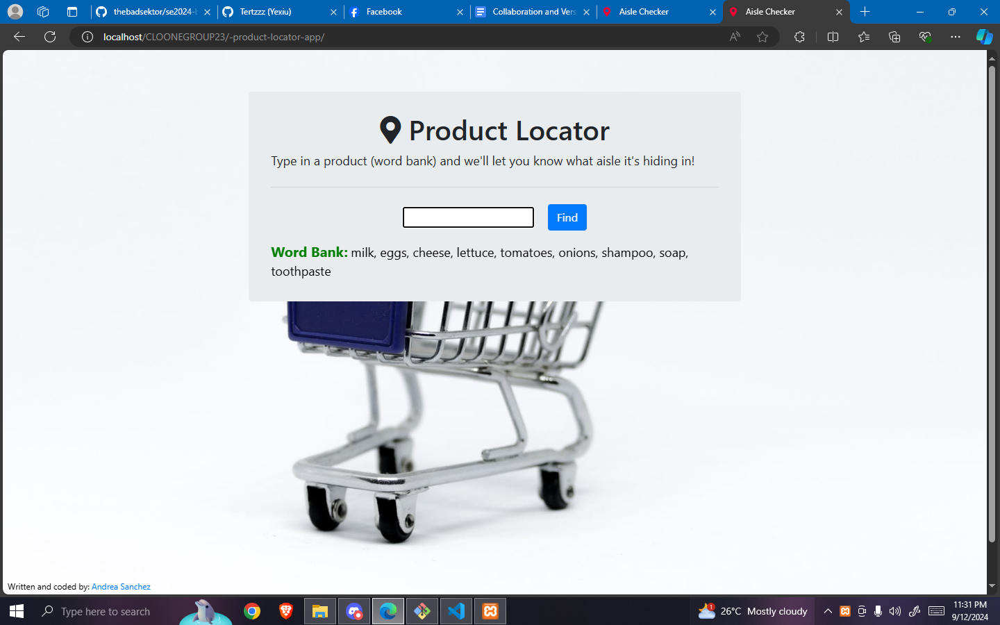
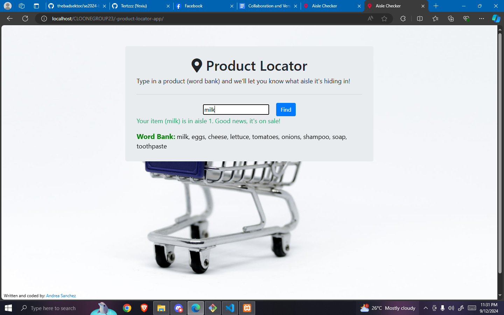

# SD-3101 Product Locator


## Table of Contents
- [Introduction](#introduction)
- [Project Overview](#project-overview)
- [Objectives](#objectives)
- [Features](#features)
- [Technologies Used](#technologies-used)
- [Setup and Installation](#setup-and-installation)
- [Usage Instructions](#usage-instructions)
- [Project Structure](#project-structure)
- [Contributors](#contributors)
- [Chagelog](#changelog)
- [Acknowledgments](#acknowledgments)
- [License](#license)

---

## Introduction

The SD-3101 Product Locator is a web-based application designed to help users 
efficiently locate products in retail stores. The application addresses the 
challenge of navigating large stores and quickly finding desired products, 
improving the overall shopping experience.

## Project Overview

Background and Context
In large retail environments, finding specific products can be challenging for customers. GPS-based systems are often impractical for indoor navigation due to signal limitations. The SD-3101 Product Locator addresses this issue by providing a manual input system where store administrators enter product locations into a static database.

Target Audience

- Administrators: Employees who manage the store’s inventory and layout. They input and update the locations of products in the system.
- Customers: Users who visit the store and use the application to search for and locate products.

Real-World Applications and Potential Impact

- Enhanced Shopping Experience: Customers can quickly find the exact aisle 
    and shelf location of products, reducing the time spent searching in-store.
- Efficient Store Management: Store administrators can easily update product 
    locations as inventory changes, ensuring the information remains accurate and up-to-date.
- Improved Store Navigation: By providing clear location data, the application helps 
    customers navigate the store more efficiently, leading to a more satisfying shopping experience.


## Objectives
Develop a Solution for Product Location Management

- Create a web application enabling store administrators to manually input 
and manage product locations, including specifying aisle and shelf details.

Implement User-Friendly Features

- Design an intuitive interface for administrators to efficiently input and update product information.
- Provide a search function for customers to easily find products by name and view their locations.

Test and Validate Accuracy and Usability

- Ensure accurate entry and display of product location data.
- Validate that search and navigation features are user-friendly and reliable.
- Verify the system’s performance under typical usage conditions for a smooth user experience.

## Features
List the main features of the project:
- Customer dashboard: Can search the product

## Technologies Used
Mention the tools, frameworks, and technologies used in the project:
- Programming Languages: JavaScript, HTML, CSS
- Frameworks/Libraries: None specified (or mention specific libraries if used, e.g., jQuery)
- Databases: HARDCODED 
- Other Tools: Git and docker

## Setup and Installation
Step-by-step instructions for setting up the project locally.

1. Clone the Repository:** Clone the repository using git bash:
    ``` bash
   https://github.com/dec23rd1986/-product-locator-app.git
   ```
2. Move the Repository: Copy the repository folder to the htdocs directory in your XAMPP installation. The path typically looks like this:
    ``` bash
    C:\xampp\htdocs\
    ```
3. Make sure to create a folder inside the htdocs where you will move the repository folder.
   
4. Check XAMPP Installation:** Ensure that XAMPP is installed correctly and that the Apache server is running. Open the XAMPP Control Panel and start the Apache module.
5. Access the Application:** Open your web browser and type the URL:
   ``` bash
   https://localhost/createdfolder/product-locator-app
   ```
   **Ensure the path matches the folder name exactly, including the case sensitivity.
   
## Usage Instructions
Provide detailed instructions on how to use the project after setup:

- After set up type http://localhost/CLOONEGROUP23/-product-locator-app/ in  browser

- Just Search the product in the search Bar.





## Project Structure
Explain the structure of the project directory.
```

└── CLOENEGROUP23/
    └── -product-locator-app/
        ├── img/
        │   └── background.jpg
        ├── composer.json
        ├── favicon.ico
        ├── image-1.png
        ├── image-2.png
        ├── image-3.png
        ├── image.png
        ├── index.css
        ├── index.html
        ├── index.js
        ├── index.php
        └── README.md
```

## Contributors

List all the team members involved in the project. Include their roles and responsibilities:

- **Kaye Anne Laloon**: Lead Developer, Backend Developer
- **Carlos Roi Barretto**: Frontend Developer, UI/UX Designer
- **Mc Angelo D. Baisas**: Frontend Developer, UI/UX Designer
- **Gerald Villaran**: Project Manager, Tester

## Project Timeline

### Week 1-2: Research and Project Planning
- 09/15/2024
- Meeting Record:
  1. Part 1
     ```
     https://www.youtube.com/watch?v=VBv-K7CVVHk&t=1s       
     ```
  2. Part 2:
     ```
     https://www.youtube.com/watch?v=em5Z982tEvU&t=322s
     ```
- Purposes Features
  
1. Login Feature since the project doesn't have one
2. Sign up
3. Add items
4. Edit items
5. Dashboard for admib
6. Dashboard for employees
7. Display hot items 
8. On sale
9. Filtering
10.Responsive
   
   - Feature: Dockerize Project
   - Target Completion: 27/10/2024
  
### Week 3-5: System Design and Setup
### Week 6-10: Implementation
### Week 11-12: Testing and Debugging
### Week 13-14: Final Presentation and Documentation

## Changelog

### [Version 1.0.0] - 2024-09-07
- Initial release of the project.
- Added basic functionality for [Feature 1], [Feature 2], and [Feature 3].

### [Version 1.1.0] - 2024-09-14
- Improved user interface for [Feature 1].
- Fixed bugs related to [Feature 2].
- Updated project documentation with setup instructions.

### [Version 1.2.0] - 2024-09-21
- Added new functionality for [Feature 4].
- Refactored codebase for better performance.
- Added unit tests for [Feature 3] and [Feature 4].


## Acknowledgments

Acknowledge any resources, mentors, or external tools that helped in completing the project.

This project was built from [Original Project Name](https://github.com/dec23rd1986/-product-locator-app.git), created by [Andrea Sanchez]. You can view the original repository [here](https://github.com/dec23rd1986/-product-locator-app.git).

## License

(no license to original author/owner)

